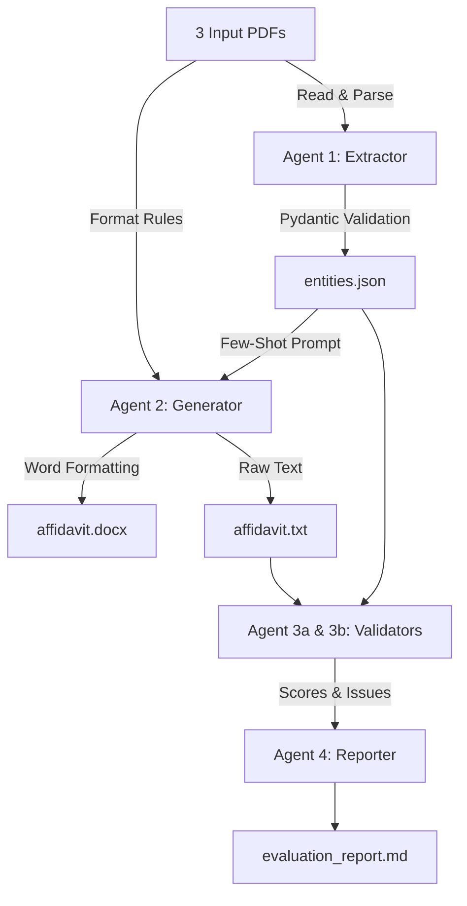

# AI Legal Document Agent

This project is an AI-powered Legal Document Generation & Evaluation Agent. It systematically reads provided PDF case files, extracts structured legal entities, drafts a perfectly formatted Affidavit in Reply as a Word document, and evaluates its own performance across six qualitative and deterministic dimensions.

## Architecture



## Setup Instructions

1. **Python Version**: Ensure you are running Python 3.11+.
2. **Install Dependencies**:
   ```bash
   pip install -r requirements.txt
   ```
3. **Environment Setup**:
   Copy the example environment file and add your Gemini API key:
   ```bash
   cp .env.example .env
   # Open .env and add: GEMINI_API_KEY=your_actual_api_key_here
   ```

## Running the Project

**To run the CLI orchestrator:**
```bash
python main.py
```

**To run the Web UI:**
```bash
streamlit run app.py
```

## Links
- **Working Application (Streamlit Cloud)**: https://kolkarpranav-legal-doc-agent-app-ektyet.streamlit.app/
- **Video Demo (Loom)**: https://drive.google.com/file/d/1tMHoz1KzvHA9Cs7c8QqkH4H8kT5wb5q5/view?usp=drive_link

## Design Decisions

- **Why 4 separate agents instead of one LLM call?** A single monolithic prompt is highly prone to hallucination, forgotten constraints, and context window pollution. Splitting extraction from generation from evaluation allows us to enforce rigid quality controls at every boundary.
- **Why Pydantic for entity schema?** Pydantic provides a strictly typed JSON contract. By forcing the extractor to conform to this schema, the Generator and Evaluator can safely assume data like `case_number` or `deponent.address` will always exist, eliminating downstream runtime crashes.
- **Why deterministic + LLM hybrid for evaluation?** LLMs struggle with absolute counting (e.g., verifying exact paragraph numbers) and boolean constraints, whereas pure Python string matching handles this flawlessly. Conversely, Python cannot detect a semantic hallucination (e.g., inventing a fake date or case precedent). A hybrid approach uses the best tool for each specific check.
- **Why Google Gemini was chosen?** Google Gemini (`gemini-1.5-flash`) provides fast, cost-effective multimodal reasoning with structured JSON support and high instruction fidelity for legal document parsing and drafting.

## Known Limitations
- The PDF extraction via `pdfplumber` assumes standard, readable text layers. It cannot perform OCR on scanned image-based PDFs.
- The `python-docx` styling uses heuristics based on capitalization to guess headings. Highly complex layouts might require precise template parsing.
- Hallucination detection relies entirely on Grok's contextual window; extremely dense documents could push the context limits, slightly degrading accuracy.

> **Note**: This project was developed with the assistance of an AI coding assistant.
